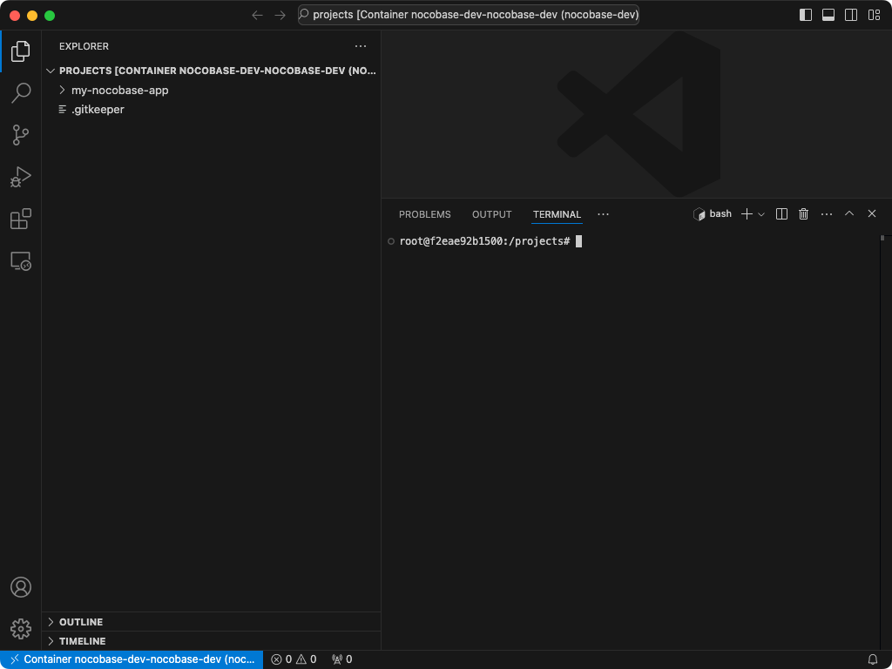
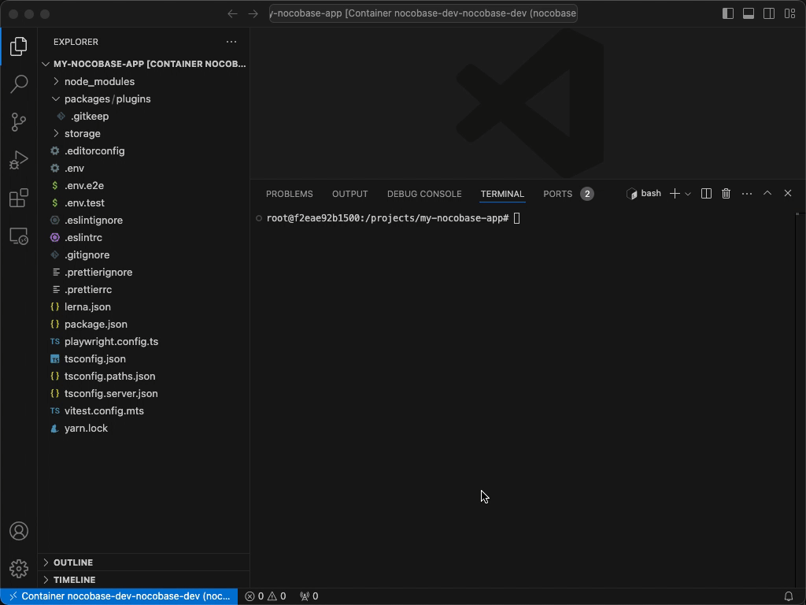

# Nocobase dev 容器开发环境

基本思路：

- 启动一个包含 nocobase 开发所需环境的容器
- 使用 vscode dev contianers 插件，在本地基于容器开发

首先需要启动容器：

```bash
git clone https://github.com/MarshalW/nocobase-dev.git
cd nocobase-dev
docker-compose up -d
```

然后启动 vscode 进入容器开发即可：

```bash
code --folder-uri vscode-remote://attached-container+$(printf "nocobase-dev" | xxd -p)/projects
```

在呼出的 vscode 中，创建项目。

这是 vscode dev contianers 插件的截图：



在 vscode 的命令行中创建项目：

```bash
# 创建 nocobase 项目
yarn create nocobase-app my-nocobase-app -d sqlite

code my-nocobase-app/
# 安装依赖包
yarn

# nocobase 的安装
yarn nocobase install --lang=zh-CN

# 进入开发模式 - 可以动态加载修改的程序
yarn dev
```

项目启动和本地浏览器访问：

